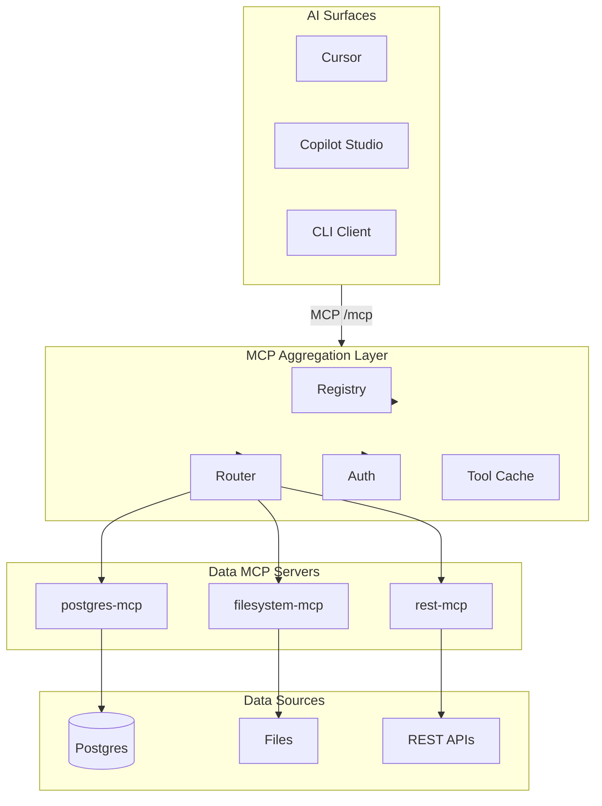

# Architecture

## Overview

The MCP Platform is a three-layer system that normalizes data access for AI surfaces through the [Model Context Protocol](https://modelcontextprotocol.io).



## Layers

### A. AI Surfaces (consumers)

Clients that speak MCP and request tools/resources. They never connect to databases directly.

- **Cursor** — via `apps/ai_adapters/cursor_adapter/mcp.json`
- **CLI** — `mcp-cli` Typer application
- **Custom apps** — use `MCPClient` from `mcp_core`

### B. Aggregator MCP Server

Single MCP endpoint (`/mcp`) that:

1. **Registers** downstream connectors in `config/registry.yaml`
2. **Aggregates** tools as `{tool}.{source}` (e.g. `query.postgres-main`)
3. **Routes** calls to the correct connector HTTP API
4. **Enforces** role-based policies from `config/policies.yaml`

### C. Data MCP Connectors

Each connector is an independent FastAPI service implementing:

| Endpoint | Purpose |
|----------|---------|
| `POST /tools/list` | List available tools |
| `POST /tools/call` | Execute a tool |
| `POST /resources/list` | List resources |
| `POST /resources/read` | Read a resource |
| `GET /health` | Health check |

## Tool namespacing

Downstream tool `query` on server `postgres-main` becomes:

```
query.postgres-main
```

Parsing uses the last `.` segment as the source id.

## Security model

| Layer | Mechanism |
|-------|-----------|
| AuthN | Optional `AGGREGATOR_API_KEY` on aggregator; per-connector bearer tokens |
| AuthZ | YAML policies — role → allowed tool names |
| Isolation | AI surfaces only see aggregator; connectors sandbox data access |

## Deployment

- **Local**: `docker compose -f docker/docker-compose.yml up`
- **Future**: Kubernetes — one connector per namespace, aggregator as ingress gateway

## Phases

| Phase | Status | Deliverables |
|-------|--------|----------------|
| 1 — MVP | Done | `mcp_core`, aggregator, postgres + filesystem connectors, CLI |
| 2 | Partial | Registry YAML, multi-server routing, auth policies |
| 3 | Planned | Copilot adapter, control plane UI, observability |
